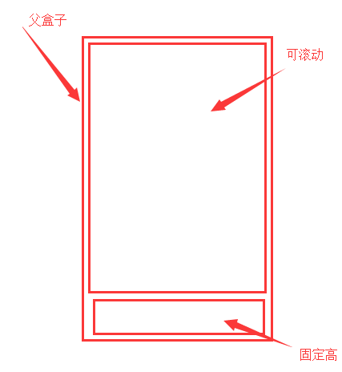

# weexQuestion
项目中遇到的weex，weex的UI相关的问题
***

|Author|wangxi|
|---|---
|E-mail|18309292050@163.com


***
## 目录
* weex简介(#weex简介)
* [一些项目中遇到的问题](#一些项目中遇到的问题)
    * px实现响应式
    * 样式改变
    * textarea中的oninput
    * weex-ui中步进器的使用
    * 多个class并写三元判断
    * weex中手机端样式显示不出原因
    * weex中的判断问题
* [weex中默认布局flex](#weex中默认布局flex)

### weex简介
```
1.h5页面，安卓，ios共用一套代码
2.h5的写法创建页面，安卓和ios调取页面的链接
3.h5调用原生的组件，安卓和ios负责拓展功能

weex的优势
1.调用的原生组件所以用户体验度好
2.h5开发速度快，节约成本

weex的劣势
1.文档不健全，学习难度大
2.坑点较多
```
### 一些项目中遇到的问题

#### 1. px实现响应式
   **每一个text标签必须单独设置font-size**，不能按照之前的逻辑父级设了子级不设
#### 2.样式改变
   -**如果要实现改变样式需要写成内部样式然后通过改变class来实现**，如果写了行内样式然后通过if来判断使用不同标签来达到切换样式是行不通的，真机上会出现复用情况，同理写了class然后用行内样式覆盖也是一样出现复用问题
   **还可以通过提供的animation模块动画时间调为0完成样式的覆盖**
#### 3.textarea中oninput
   **真机使用这个事件无法获取到框内的值并且里面没有value属性**
   **解决方案：**
   ```javascript
   //1.data中设置一个对象
   textareaObj:{},
   //2.加载数据时给对象中添加对应个数的属性
   for(let i= 0; i < this.lists.length; ++i){
      let textareaValue={};
      let store_id =this.lists[i].store_id;
      textareaValue[store_id] ='';
      Object.assign(this.textareaObj,textareaValue);
   }
   //3.查找对应属性的值并实现实时绑定
   v-model="textareaObj[item.store_id]"
   ```
#### 4.weex-ui中步进器的使用
   -单个步进器毫无问题直接data里写个变量然后用提供的方法改变变量的值即可
   **多个步进器的使用：**
   **(1).通过ref获取到对应步进器的值，然后用提供的方法进行动态替换**
   ```javascript
   <wxc-stepper ref="stepper" 
     :default-value="item1.goods_num"
     step="1"
     :max="item1.goods_stock_count"
     min="1"
     @wxcStepperValueChanged="stepperValueChange"
     ></wxc-stepper>
   ```
   **(2).由于不知道点击的步进器是那一个所以我进行了无差别替换**（两层for循环是为了找到data中对应总数据变量中的值，替换了这个值页面会相应的变化）
   ```javascript
   stepperValueChange(e) {
     let times = 0;
     for (let i= 0; i < this.list.length; ++i) {
       for (let w = 0; w < this.lists[i].cartList.length; ++w) {
         times++;
         if(
           this.list[i].cartList[w].goods_num !=
           this.$refs.stepper[times - 1].value
         ){
           let num = this.$refs.stepper[times - 1].value;
           //获取数据的方法
           this.$api(
            "/api/cart",
            {
              cart_id: this.list[i].cartList[w].cart_id,
              cart_num: num
            },
            res => {
              //请求完成  status为1表示请求成功
              if(res.status == 1){
                this.lists[i].cartList[w].goods_num = num;
                this.allFunction();
              }else {
                //modal模块中的toast
                modal.toast({
                  message: res.msg,
                  duration: 1.5
                })
              }
            })
          }
        }
     }
   }
   ```
#### 5.多个class并写三元判断
```javascript
  <text :class="['iconfont','icon',( acticeTab == i ? 'active' : '' )]">{{tab.icon}}</text>
```
#### 6.weex中手机端样式显示不出原因
```javascript
  //(1) 假如上一句报错，则下一句不执行（app中没有window）
  if(window)window.addEventListener("message", this.onMessage, false);
  this.twoBtn_bol();
```
#### 7.weex中的判断问题
   **尽量使用v-if判断，不要用v-else-if,v-else!因为有可能导致样式复用！**
   ```javascript
       //如果判断true或false，请使用
       <div v-if ="BfMeberDetail == 0"></div>
       //如果用下面的写法可能会导致组件复用
       <div v-if ="!BfMeberDetail"></div>
   ```
### weex中默认布局flex
-啰嗦几句，**Flexbox 是weex中默认且唯一的布局模型**，虽然刚开始用flex可能你会不习惯，但是请坚持使用它，它会为你带来便利！
-大多数flex的布局方式请参考文档自行摸索，我这里说一种实用，文档中没有的布局方式
####1.占满剩余部分 flex:1



```javascipt
//父盒子给绝对定位
.wrap {
   position: absolute;
   top: 0;
   bottom: 0;
   left: 0;
   right: 0;
}
//可滚动部分设置
.scroller {
   flex: 1;
}
//底部固定高
```
